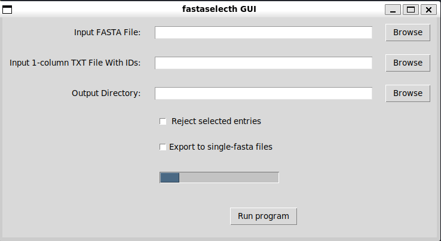

# fastaselecth-GUI

A fast lightweight windows x86_64 GUI wrapper for fastaselecth

## Installation

1. install [wsl](https://github.com/BioGUIwslLab/WSL-Installation)
2. Download `fastaselecth GUI.exe` from the `bin/gui/` folder
3. Download the binary `fastaselecth` using wget:

```bash
wget -O /tmp/fastaselecth https://github.com/BioGUIwslLab/fastaselecth-GUI/raw/refs/heads/main/bin/cmd/fastaselecth
```

4. Make it executable:

```bash
chmod +x /tmp/fastaselecth
```

5. Move it to /usr/bin for global access:

```bash
sudo mv /tmp/fastaselecth /usr/bin/fastaselecth
```
## Usage



Click `browse` to select the input fasta, txt and output directory to save the output fasta file

The output fasta file will the the same filename as the input txt file but with a `.fasta` extension.

If Rejection of the entries of the input txt file is selected the output will contain all the entries but those within the input txt file. In that case the output file will have a `non_` prefix, the input txt filename and a `.fasta` extension.

If an identifier doesn't exist in the fasta file that identifier will be ignored

The data used as an example in the data folder have been derived from solgenomics.net
